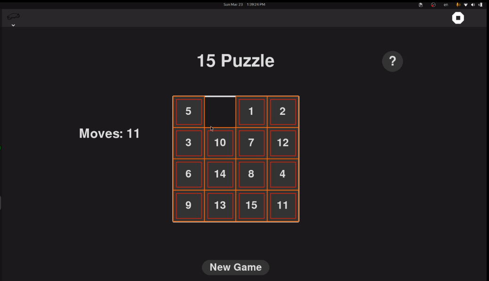
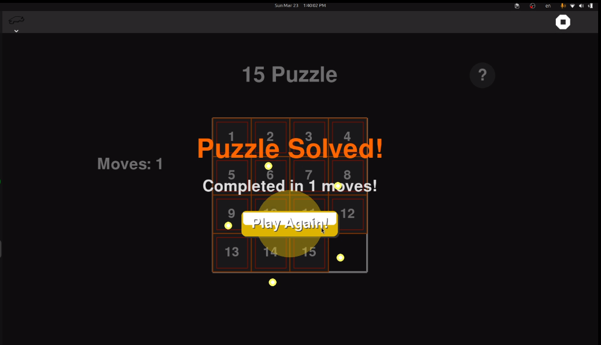

# 15 Puzzle Game

The 15 Puzzle is a classic sliding puzzle that consists of a 4x4 grid with 15 numbered tiles and one empty space. The objective is to arrange the tiles in ascending numerical order by making sliding moves that use the empty space.




## How to Play

### Starting the Game:
Launch the 15 Puzzle game application.

### Objective:
Arrange the numbered tiles in order (1–15), using the empty space to slide tiles.

### Controls:
Click or tap a tile adjacent to the empty space to slide it.

### Winning the Game:
You win when all tiles are in order from 1 to 15, left to right, top to bottom, with the empty space in the bottom-right corner.

How to use?
===========

Fifteen Puzzle game can be run on the Sugar desktop. Please refer to;

* [How to Get Sugar on sugarlabs.org](https://sugarlabs.org/),
* [How to use Sugar](https://help.sugarlabs.org/)


How to run?
=================

Dependencies:- 
- Python >= 3.10
- PyGObject >= 3.42
- PyGame >= 2.5
  
These dependencies need to be manually installed on Debian, Ubuntu and Fedora distributions.


**Running outside Sugar**


- Install the dependencies

- Clone the repo and run -
```
git clone https://github.com/Bishoywadea/FifteenPuzzle
cd FifteenPuzzle
python main.py
```

**Running inside Sugar**

- Open Terminal activity and change to the Fifteen Puzzle activity directory
```
cd activities\FifteenPuzzle.activity
```
- To run
```
sugar-activity3 .
```
